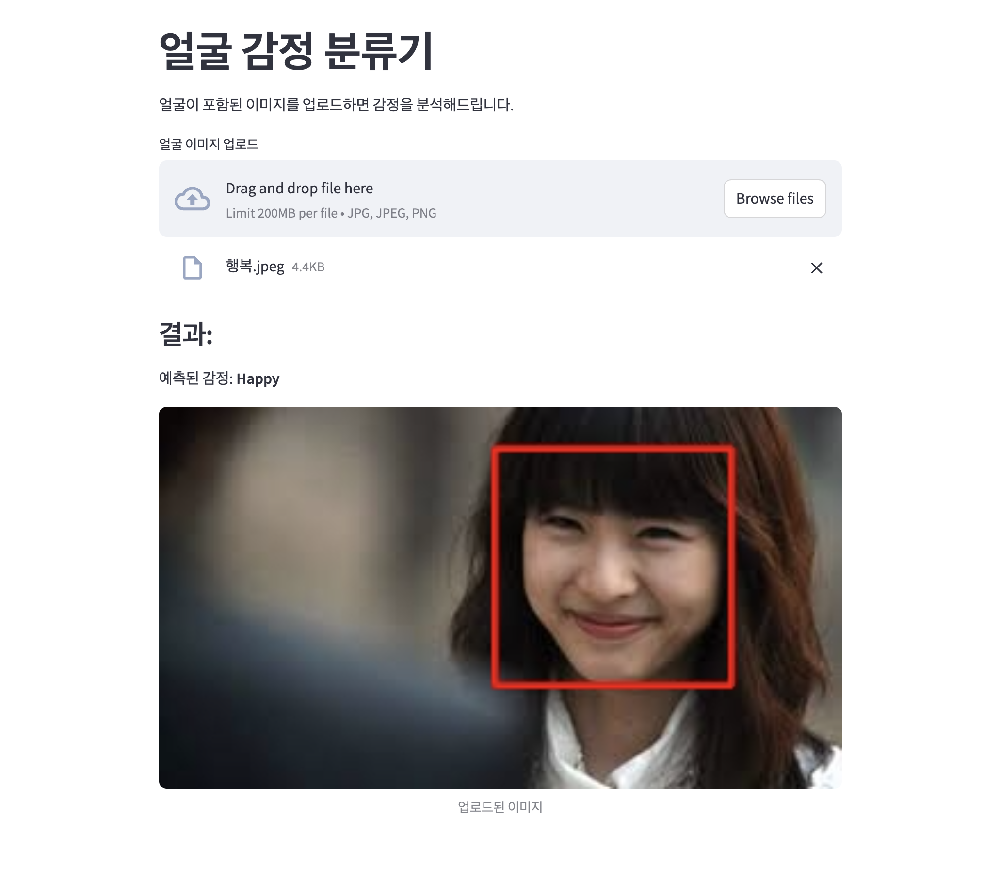

# 얼굴 감정 분류기

사용자가 업로드한 얼굴 이미지를 기반으로, 사전 학습된 딥러닝 모델을 통해 감정을 분류하는 웹 애플리케이션입니다.
Streamlit을 통해 직관적인 UI로 누구나 쉽게 사용할 수 있습니다.

---

## 🔍 주요 기능

- 얼굴 자동 검출 (OpenCV 기반)
- 사전 학습된 ONNX 모델을 통한 감정 예측
- 7가지 감정 라벨 분류 (Angry, Disgust, Fear, Happy, Sad, Surprise, Neutral)
- 감정 결과 시각화 및 얼굴 영역 박스 표시
- Streamlit Cloud를 통한 웹 배포
